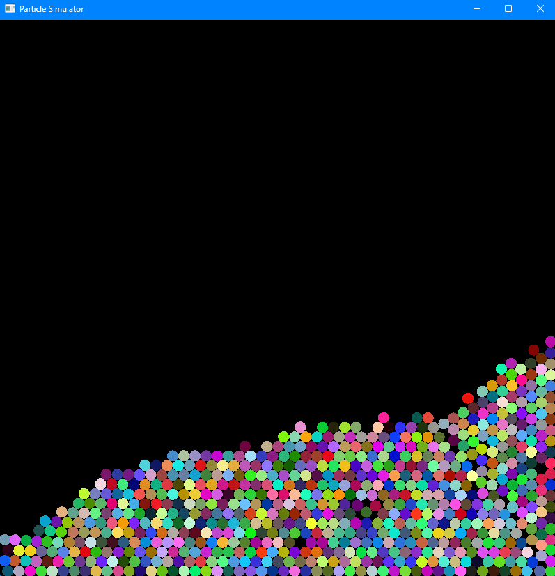
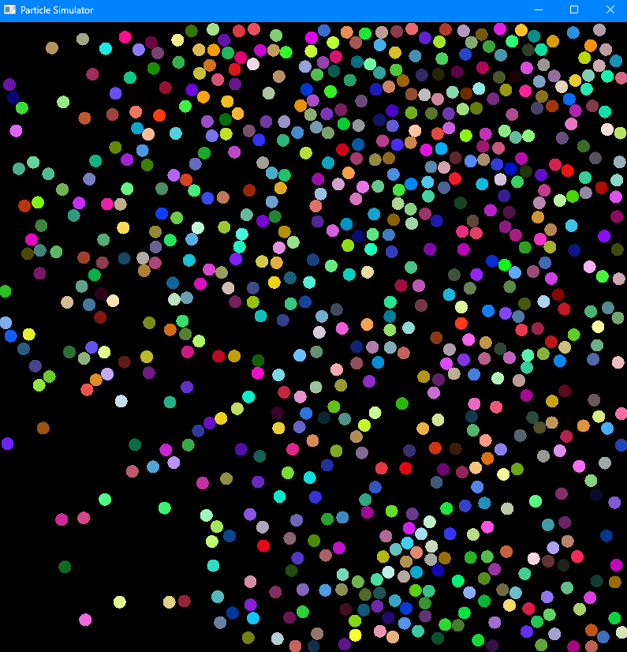

# Cuda Accelerated Particle Simulator

## Overview
The Particle Simulator is a C++ project built with OpenGL for visualization and CUDA architecture for performance optimization. This simulator models 2D particle movements, elastic collisions with boundaries and other particles, and supports simulations both with and without gravitational effects.




## Features
- **2D Particle Movements:** Simulates the trajectories of particles in a two-dimensional space.
- **Elastic Collisions:** Models realistic elastic collisions between particles and boundaries.
- **Gravity Toggle:** Enables or disables the effects of gravity on particle motion.
- **Real-Time Rendering:** Uses OpenGL for fast and interactive visualization.
- **High Performance:** Optimized with CUDA to handle a large number of particles efficiently.





## Requirements
### Software
- C++ compiler (supporting C++17 or later)
- CUDA Toolkit (11.0 or later)
- OpenGL (4.0 or later)
- GLFW library
- GLAD library

### Hardware
- NVIDIA GPU with CUDA support

## Installation
1. **Clone the Repository**
   ```bash
   git clone git@github.com:KyNgo2002/Particle-Simulator.git
   cd particle-simulator
   ```

2. **Install Dependencies**
   - Ensure that OpenGL, GLFW, and GLAD are installed on your system.
   - Install the CUDA Toolkit from the NVIDIA website.

<!--
3. **Build the Project**
   - Use the provided `CMakeLists.txt` to configure and build the project:
     ```bash
     mkdir build
     cd build
     cmake ..
     make
     ```

4. **Run the Simulator**
   ```bash
   ./particle_simulator
   ```
-->

## Usage
- **Gravity Toggle:** Use the keyboard shortcut (e.g., `G`) to toggle gravity on or off.
- **Pause Simulation:** Press `Space` to reset the simulation.
- **Exit Simulation:** Press `Esc` to reset the simulation.

<!--
## File Structure
```
particle-simulator/
├── src/
│   ├── main.cpp         # Entry point of the application
│   ├── renderer.cpp     # OpenGL rendering logic
│   ├── physics.cpp      # Physics calculations (collisions, gravity)
│   ├── cuda_kernel.cu   # CUDA optimization kernels
├── include/
│   ├── renderer.h       # Header for rendering logic
│   ├── physics.h        # Header for physics calculations
├── shaders/
│   ├── vertex.glsl      # Vertex shader
│   ├── fragment.glsl    # Fragment shader
├── CMakeLists.txt       # Build configuration
└── README.md            # Project documentation
```
-->


### CUDA Optimization
- **Parallel Computations:** Collision detection and particle updates are computed in parallel using CUDA kernels, drastically improving performance for large particle counts.


## Acknowledgments
- AI was used in the creation of this ReadMe, as well as for research purposes.
- OpenGL for rendering support.
- CUDA for enabling high-performance computations.
- GLFW and GLAD for simplifying OpenGL integration.

## Contact
My LinkedIn: https://www.linkedin.com/in/ky-ngo/

My Github: https://github.com/KyNgo2002

My Portfolio: https://kyngo2002.github.io/portfolio/

For questions or support, please contact [Kyngo992@gmail.com].


